# 🔍 HireLens — AI Resume Analyzer

🚀 AI-powered web app that analyzes resumes, gives scores, and suggests improvements instantly.

---

## 🌐 Live Demo

🔗‍️ https://ai-hirelensx.netlify.app/

---

## ✨ Features

* 🎯 Resume Score (out of 100)
* 🤖 ATS Compatibility Check
* 💡 Missing Skills Detection
* 📈 Smart AI Suggestions
* ⚡ Instant Analysis (Gemini AI powered)
* 🔒 Privacy-first (No data stored)

---

## 🧠 How It Works

1. Upload Resume
2. Enter Target Job Role
3. Get AI Feedback (Score + Suggestions)

---

## 📊 Sample Output

* Score: 78%
* Missing Skills: React Hooks, System Design
* Suggestions: Improve project descriptions with measurable impact

---

## 🛠️ Tech Stack

* Frontend: React + Vite
* Styling: CSS / Inline styles
* AI: Google Gemini API
* Deployment: Netlify

---

## 📸 Screenshots

### 🏠 Home Page
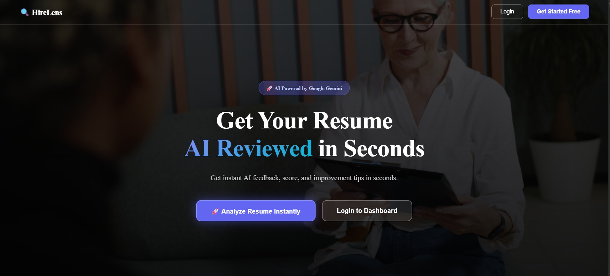

### ✨ Features Section
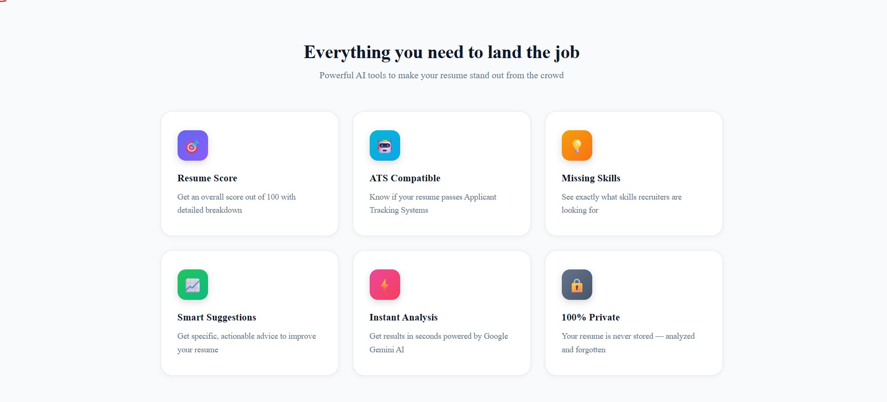

### 🔐 Login Page
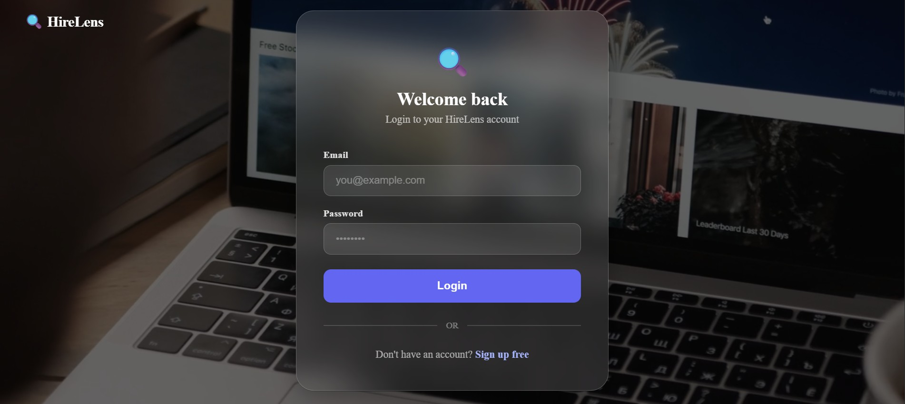

### 📊 Dashboard
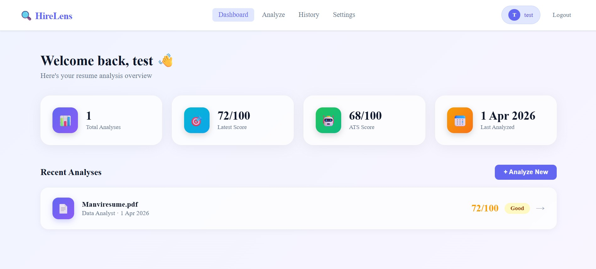

### 📄 Resume Analysis
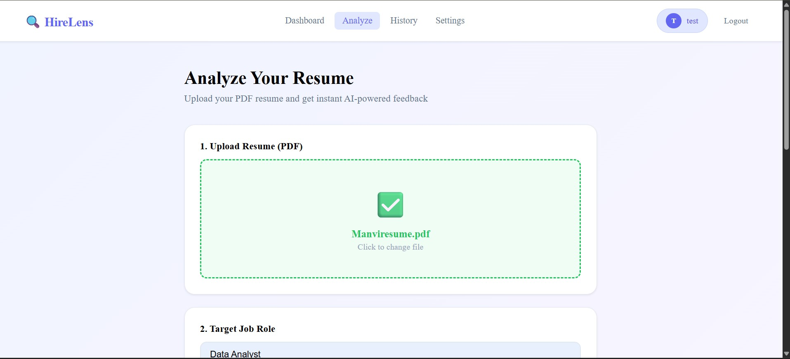
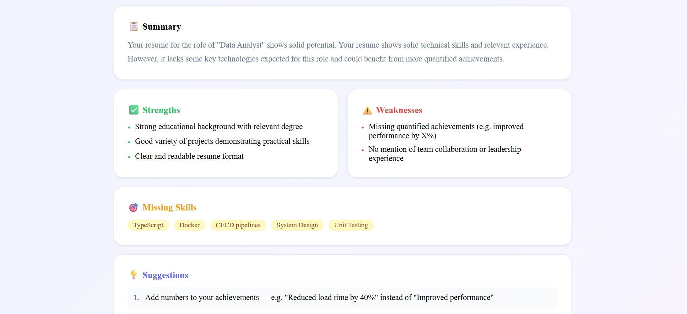
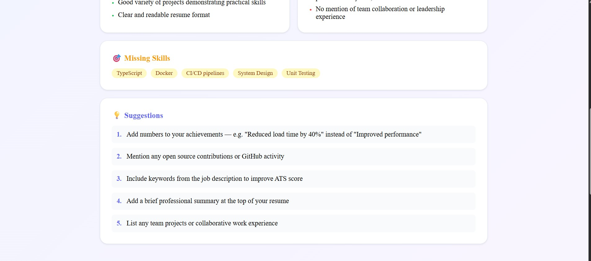

### 🧠 AI Feedback
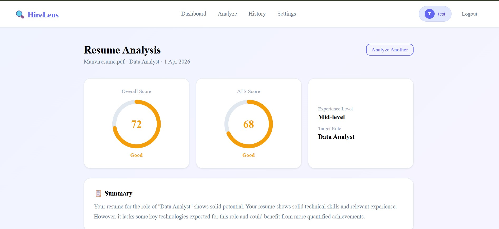


### 📜 History Page
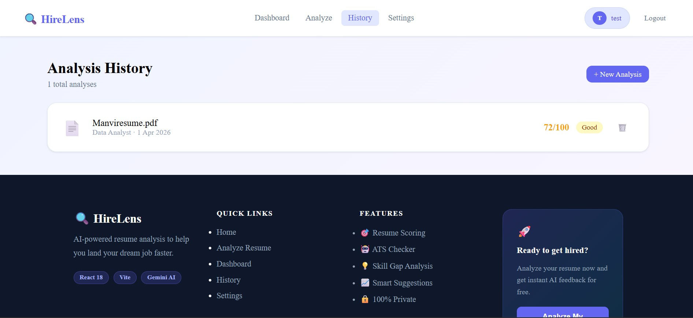

### ⚙️ Settings
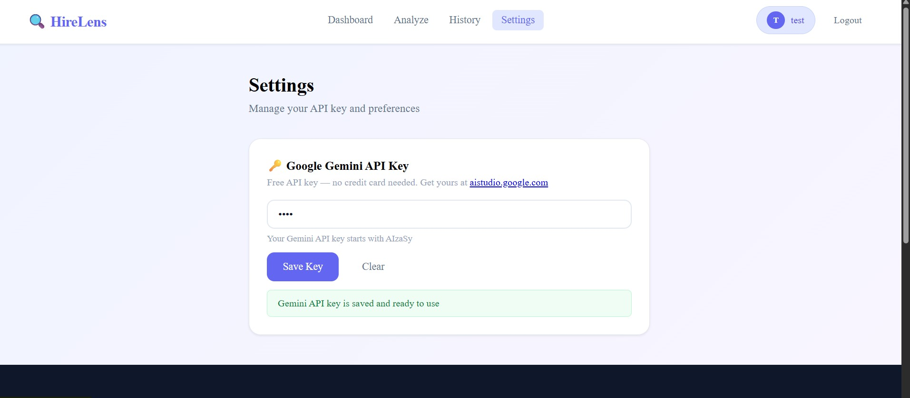

### 🦶 Footer
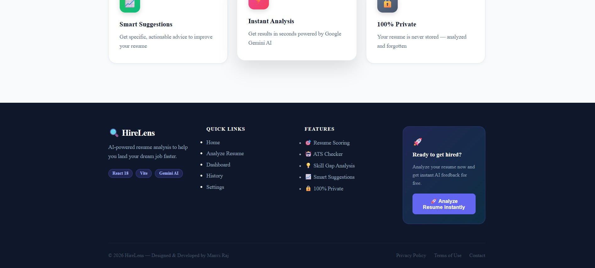


---

## 🚀 Getting Started

```bash
git clone https://github.com/rajmanvi17/ai-hirelens.git
cd ai-hirelens
npm install
npm run dev
```

---

## 👩‍💻 Author

**Manvi Raj**

🔗‍️  GitHub: https://github.com/rajmanvi17
<br>
🔗‍️  LinkedIn: https://www.linkedin.com/in/manvi-raj-593747274
<br>
🔗‍️  Medium: https://medium.com/@manvi.raj60

---

## ⭐ Show your support

If you like this project, give it a ⭐ on GitHub!
